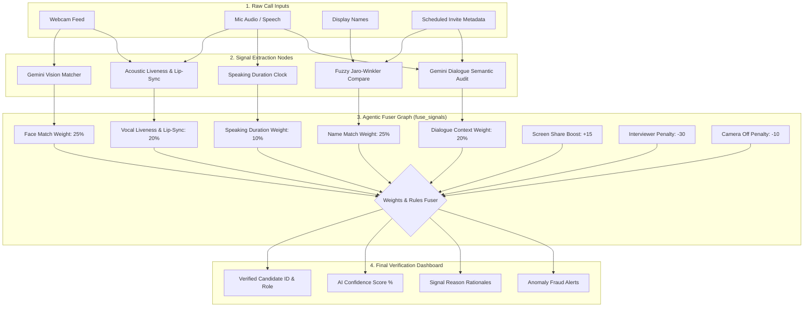

# Sherlock Real-Time Candidate Identity Detector

Sherlock is an AI-powered candidate identification system designed for live video calls (Google Meet, Microsoft Teams, and Zoom). By fusing physical indicators, facial biometrics, audio liveness, and LLM dialogue semantics, Sherlock automatically identifies the correct interview candidate in real time and detects potential proxy interviewers or voice clone fraud.

---

## 1. System Architecture & Fusion Pipeline

The flowchart below represents how raw meeting signals are processed, weighted by the agentic fuser node, and output to the dashboard:



---

## 2. Multi-Signal Fusion Weights Breakdown

To ensure robust results, Sherlock fuses **5 distinct weak signals**:

* **Biometric Face Verification (25% weight):** Gemini Vision compares the live webcam frame of the suspected candidate against the baseline profile image on file.
* **Scheduled Name Match (25% weight):** Uses fuzzy comparison (Jaro-Winkler token sort ratio) to compare connected display names to the scheduled candidate name.
* **Dialogue Semantics (LLM Context - 20% weight):** Gemini analyzes the transcript. The speaker answering technical details, describing code, and explaining experiences is attributed candidate points.
* **Audio Liveness & Lip-Sync (20% weight):** Audits whether the audio is a real human voice vs an AI clone, and checks if vocal spikes align with the webcam lip movements to detect off-camera proxy speakers.
* **Speaking Duration Ratio (10% weight):** Calculates the percentage of active talk ratio per participant connection.

### Offsets & Security Triggers:
* **Active Screen Share (+15 Boost):** Candidate gets a +15 score boost if they present their screen.
* **Interviewer Name Match (-30 Penalty):** Participant gets heavily penalized if their name matches any interviewer on the calendar invite.
* **Webcam Off (-10 Penalty):** Penalizes candidate verification confidence by 10 points if they turn off their camera.
* **Face Match Mismatch (-30 Penalty & Fraud Alert):** Triggered if the live webcam frame does not match the baseline profile photo, indicating a proxy interviewer joined.
* **Lip-Sync Mismatch (-10 Penalty & Alert):** Triggered if we cannot verify audio-visual alignment.

---

## 3. Clone & Running Instructions (For Reviewers)

### Clone the Repository
```bash
git clone https://github.com/onkar-2006/Sherlock_internship_challenge_codebase.git
cd Sherlock_internship_challenge_codebase
```

### Backend Setup
1. Navigate to the backend directory and install dependencies:
   ```bash
   cd backend
   pip install fastapi uvicorn langchain-google-genai rapidfuzz
   ```
2. Run the FastAPI server:
   ```bash
   python main.py
   ```
   *(Running on `http://127.0.0.1:8000`)*

### Frontend Setup
1. Open a new terminal window, navigate to the frontend directory, and install dependencies:
   ```bash
   cd frontend
   npm install
   ```
2. Start the Vite React development server:
   ```bash
   npm run dev
   ```
   *(Running on `http://localhost:5173`)*

---

## 4. Verification Guide
1. Open **`http://localhost:5173/`** in Tab 1 (Join as Interviewer: `Alice Smith`).
2. Open **`http://localhost:5173/`** in Tab 2 (Join as Candidate: `MacBook Pro`).
3. Click **Camera ON** on the Candidate tab.
4. **Observe:** The Interviewer's screen shows the on-file baseline photo next to the Candidate's live webcam frame, rendering dynamic face match and vocal lip-sync alignment scores in the sidebar!
